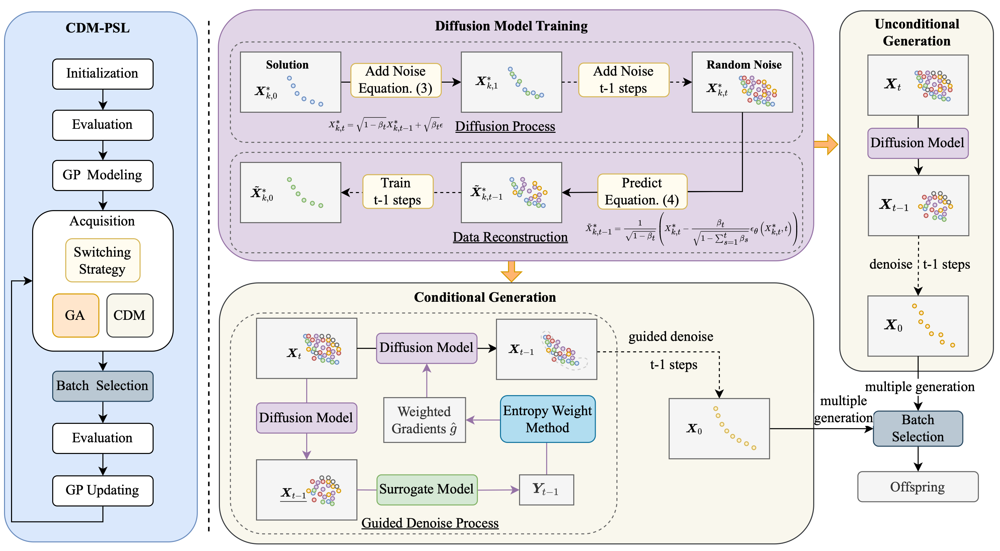

<h1 align="center"> CDM-PSL: Expensive Multi-Objective Bayesian Optimization Based on Diffusion Models </h1>

This repository includes the code for the paper “_**Expensive Multi-Objective Bayesian Optimization Based on Diffusion Models**_”, which has been accepted at **AAAI 2025**. The preprint is at: https://arxiv.org/abs/2405.08674

## 💥 News 💥

- 🎉🎉🎉 **[Dec 10, 2024]** Our paper is accepted at AAAI 2025!
  
## Abstract

**CDM-PSL (Composite Diffusion Model-Based Pareto Set Learning)** is a novel algorithm designed to address the challenges of expensive multi-objective Bayesian optimization (EMOBO). While MOBO has shown great potential in solving expensive multi-objective optimization problems (EMOPs), it struggles to model complex distributions of the Pareto optimal solutions when only a limited number of function evaluations are available.

Existing Pareto set learning methods often exhibit instability in expensive scenarios, leading to significant deviations between the obtained solution set and the true Pareto set (PS). To overcome these challenges, CDM-PSL introduces **Composite Diffusion Model** to enhance optimization performance.

## Overview



## 🚀 Getting Started

### Install dependencies

```
cd CDM-PSL/cdm_psl
pip install -r requirements.txt
```

### Run CDM-PSL on DTLZ2

```
bash example_dtlz2.sh
```

### File Structure
```
cdm_psl/
├── 📂 evolution/         
├── 📂 learning/          
├── 📂 mobo/               
├── 📜 data_enhancement.py # Data augmentation utilities
├── 📜 diffusion.py        # [Core] Diffusion model implementation
├── 🗒️ example_dtlz2.sh    # Example execution scripts
├── 📜 lhs.py              # Latin Hypercube Sampling utilities
├── 📜 problem.py          # Problem definition
├── 📜 run_d20.py          # [Main] Main algorithm workflow
└── 📜 utils.py            # Common utility functions
```


## Citation

If you find our work helpful, please cite the following BibTeX entry:

```
@article{li2024expensive,
  title={Expensive Multi-Objective Bayesian Optimization Based on Diffusion Models},
  author={Li, Bingdong and Di, Zixiang and Lu, Yongfan and Qian, Hong and Wang, Feng and Yang, Peng and Tang, Ke and Zhou, Aimin},
  journal={accepted by AAAI},
  year={2025}
}
```
